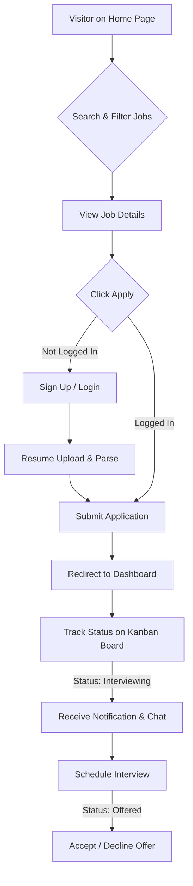
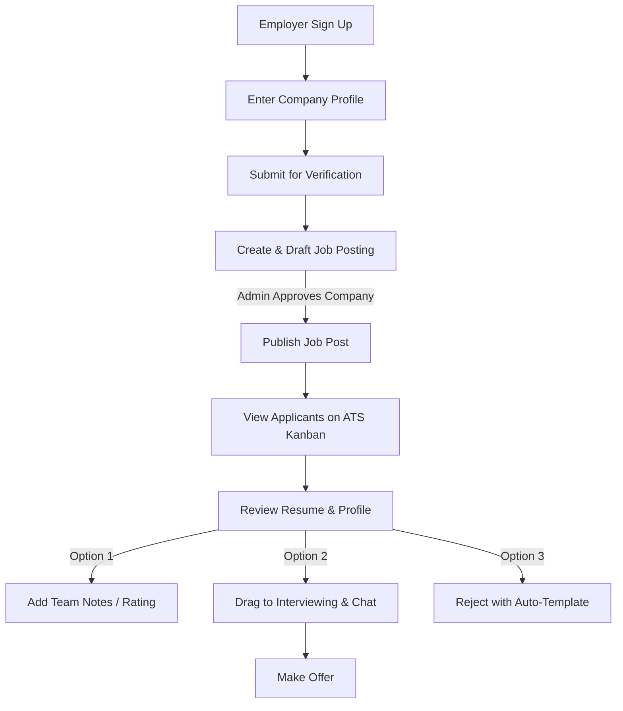
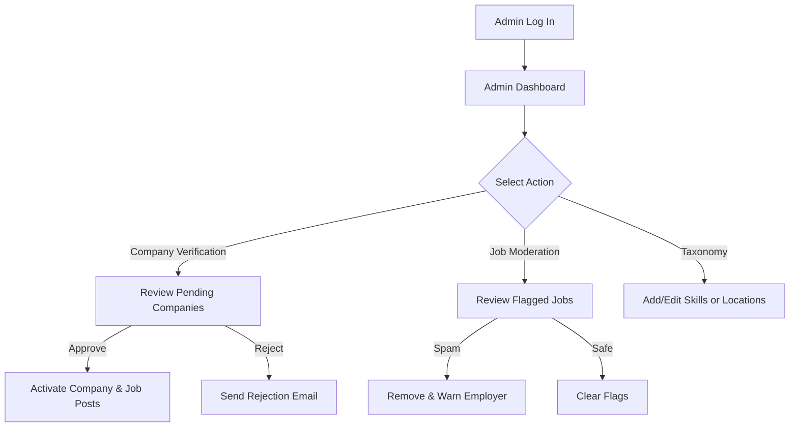

# 🔄 Jobs View - User Flows

This document details the step-by-step journeys of Candidates, Employers, and Admins navigating the Jobs View platform.

---

## 1. Candidate Journey: Job Discovery to Offer

The candidate journey is optimized for speed, clarity, and feedback.

### 1.1 Flow Chart

### 1.2 Step-by-Step Experience
1. **Discovery:** A visitor lands on the homepage and uses the search bar and filters to find jobs matching their skills (e.g., "Go", "React").
2. **Review:** The user clicks a job card, viewing details like salary, tech stack, and company info without leaving the search context (side-drawer layout).
3. **Application:** Clicking "Apply" prompts a sign-in or quick sign-up. If it's a new user, they upload a PDF resume, which is parsed in 2 seconds to fill out their profile. They review the parsed info and click "Submit Application".
4. **Tracking:** The candidate is redirected to their Dashboard. The application is visible under the **Applied** column of their Kanban board.
5. **Update:** When the employer views the resume, the status changes to **Reviewed**. The candidate receives a real-time notification.
6. **Engagement:** If shortlisted, the candidate is moved to **Interviewing**. They receive an email/in-app notification, opening a chat thread with the employer to select interview slots.

---

## 2. Employer Journey: Setup to Hiring

The employer journey is designed to be a lightweight, collaborative ATS.

### 2.1 Flow Chart

### 2.2 Step-by-Step Experience
1. **Registration:** An employer registers using their business email (e.g., `hr@acme.com`).
2. **Company Setup:** They enter company information (website, description, size, logo). The system automatically queues the company for domain verification.
3. **Drafting:** While verification is pending, the employer can create job postings, which are saved as drafts.
4. **Publishing:** Once the admin approves the company, the drafts can be published and become publicly searchable.
5. **Applicant Review:** As candidates apply, they appear in the **Applied** column of the job's ATS Kanban board. The employer clicks a card to open the candidate's parsed profile and PDF resume.
6. **Collaboration:** The employer invites a colleague to review. They leave ratings and notes on the candidate.
7. **Action:** The employer drags the candidate to **Interviewing**, which automatically opens a chat interface and sends a meeting proposal. Alternatively, they drag the candidate to **Rejected**, choosing a template reason that is sent to the candidate.

---

## 3. Admin Journey: Platform Operations

The admin journey focus is on quality control, verification, and moderation.

### 3.1 Flow Chart

### 3.2 Step-by-Step Experience
1. **Authentication:** The admin logs into the secure `/admin` portal.
2. **Dashboard Overview:** They review platform health metrics (daily sign-ups, active jobs, flagged content).
3. **Company Verification:** They navigate to the **Verification Queue**. They click on a company, check that the domain matches the business website, and verify the company's legitimacy. They click "Approve," which immediately publishes all draft jobs for that company.
4. **Moderation:** They check the **Flagged Jobs Queue**. If a job is marked as spam, they archive the job and send a warning to the employer.
