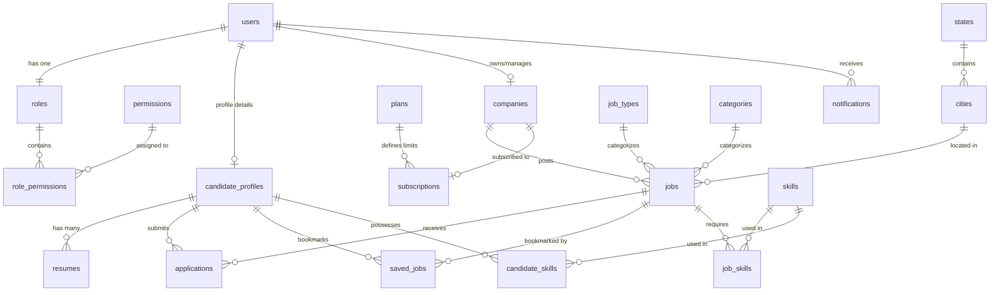

# 🗄️ Jobs View - Database Schema Design

Jobs View uses **PostgreSQL** as its primary relational database. This ensures strict data integrity, supports complex queries (e.g., job filtering, applicant tracking), and provides ACID compliance for billing and applications.

---

## 1. Entity Relationship (ER) Diagram

---

## 2. Table Schemas

### 2.1 Core Authentication & Authorization

#### `roles`
| Column | Type | Constraints | Description |
| :--- | :--- | :--- | :--- |
| `id` | SERIAL | PRIMARY KEY | Role identifier |
| `name` | VARCHAR(50) | UNIQUE, NOT NULL | Role name (`candidate`, `employer`, `admin`) |
| `description` | TEXT | | Brief description of the role |
| `created_at` | TIMESTAMP | DEFAULT NOW() | Creation timestamp |

#### `permissions`
| Column | Type | Constraints | Description |
| :--- | :--- | :--- | :--- |
| `id` | SERIAL | PRIMARY KEY | Permission identifier |
| `name` | VARCHAR(100) | UNIQUE, NOT NULL | Permission name (e.g., `job:create`, `user:suspend`) |
| `description` | TEXT | | Brief description of the permission |

#### `role_permissions`
| Column | Type | Constraints | Description |
| :--- | :--- | :--- | :--- |
| `role_id` | INT | FK -> `roles.id`, PRIMARY KEY | Part of composite primary key |
| `permission_id` | INT | FK -> `permissions.id`, PRIMARY KEY | Part of composite primary key |

#### `users`
| Column | Type | Constraints | Description |
| :--- | :--- | :--- | :--- |
| `id` | UUID | PRIMARY KEY, DEFAULT gen_random_uuid() | Unique user identifier |
| `email` | VARCHAR(255) | UNIQUE, NOT NULL | User's email address |
| `password_hash` | VARCHAR(255) | NOT NULL | BCrypt hash of the password |
| `role_id` | INT | FK -> `roles.id`, NOT NULL | User's role |
| `is_active` | BOOLEAN | DEFAULT TRUE | Account status (active/suspended) |
| `created_at` | TIMESTAMP | DEFAULT NOW() | Account creation time |
| `updated_at` | TIMESTAMP | DEFAULT NOW() | Account update time |

---

### 2.2 Candidates

#### `candidate_profiles`
| Column | Type | Constraints | Description |
| :--- | :--- | :--- | :--- |
| `id` | UUID | PRIMARY KEY, DEFAULT gen_random_uuid() | Profile identifier |
| `user_id` | UUID | FK -> `users.id` ON DELETE CASCADE, UNIQUE | Linked user account |
| `first_name` | VARCHAR(100) | NOT NULL | Candidate's first name |
| `last_name` | VARCHAR(100) | NOT NULL | Candidate's last name |
| `bio` | TEXT | | Brief bio / summary |
| `phone` | VARCHAR(20) | | Contact phone number |
| `title` | VARCHAR(150) | | Professional title (e.g., "React Engineer") |
| `profile_image_url` | TEXT | | Profile image link |
| `visibility` | VARCHAR(20) | DEFAULT 'public' | `public` or `private` |
| `completed_score` | INT | DEFAULT 0 | Profile completion percentage (0-100) |
| `created_at` | TIMESTAMP | DEFAULT NOW() | Profile creation time |
| `updated_at` | TIMESTAMP | DEFAULT NOW() | Profile update time |

#### `resumes`
| Column | Type | Constraints | Description |
| :--- | :--- | :--- | :--- |
| `id` | UUID | PRIMARY KEY, DEFAULT gen_random_uuid() | Resume identifier |
| `candidate_profile_id`| UUID | FK -> `candidate_profiles.id` ON DELETE CASCADE | Owner's profile |
| `file_name` | VARCHAR(255) | NOT NULL | Original filename of PDF |
| `file_url` | TEXT | NOT NULL | Cloudflare R2 file URL |
| `parsed_json` | JSONB | | Structured resume details (skills, jobs) |
| `is_primary` | BOOLEAN | DEFAULT FALSE | If true, used for quick-applies |
| `created_at` | TIMESTAMP | DEFAULT NOW() | Upload timestamp |
| `updated_at` | TIMESTAMP | DEFAULT NOW() | Update timestamp |

---

### 2.3 Employers & Subscriptions

#### `companies`
| Column | Type | Constraints | Description |
| :--- | :--- | :--- | :--- |
| `id` | UUID | PRIMARY KEY, DEFAULT gen_random_uuid() | Company identifier |
| `user_id` | UUID | FK -> `users.id` ON DELETE RESTRICT | Creator / Owner account |
| `name` | VARCHAR(150) | NOT NULL | Company name |
| `slug` | VARCHAR(150) | UNIQUE, NOT NULL | URL slug (e.g., `acme-corp`) |
| `website` | VARCHAR(255) | | Company website URL |
| `logo_url` | TEXT | | Logo image link |
| `description` | TEXT | | Detailed company description |
| `size_range` | VARCHAR(50) | | e.g., "1-10", "11-50", "51-200" |
| `industry` | VARCHAR(100) | | Core industry |
| `location` | VARCHAR(255) | | Headquarter city/country |
| `is_verified` | BOOLEAN | DEFAULT FALSE | Admin verification status |
| `verified_at` | TIMESTAMP | | Verification timestamp |
| `created_at` | TIMESTAMP | DEFAULT NOW() | Creation time |
| `updated_at` | TIMESTAMP | DEFAULT NOW() | Update time |

#### `plans`
| Column | Type | Constraints | Description |
| :--- | :--- | :--- | :--- |
| `id` | SERIAL | PRIMARY KEY | Plan identifier |
| `name` | VARCHAR(50) | UNIQUE, NOT NULL | Plan name (e.g., `Free`, `Pro`, `Enterprise`) |
| `price` | NUMERIC(10, 2) | NOT NULL | Monthly price in USD |
| `billing_interval` | VARCHAR(20) | DEFAULT 'month' | `month` or `year` |
| `job_posting_limit`| INT | DEFAULT 3 | Max active job postings |
| `features_json` | JSONB | | Additional limits and enabled features |
| `created_at` | TIMESTAMP | DEFAULT NOW() | Plan creation time |

#### `subscriptions`
| Column | Type | Constraints | Description |
| :--- | :--- | :--- | :--- |
| `id` | UUID | PRIMARY KEY, DEFAULT gen_random_uuid() | Subscription identifier |
| `company_id` | UUID | FK -> `companies.id` ON DELETE CASCADE | Subscribed company |
| `plan_id` | INT | FK -> `plans.id`, NOT NULL | Active plan |
| `stripe_subscription_id`| VARCHAR(255) | UNIQUE | Stripe subscription ID |
| `status` | VARCHAR(50) | NOT NULL | e.g., `active`, `past_due`, `canceled` |
| `current_period_start`| TIMESTAMP | NOT NULL | Start of billing cycle |
| `current_period_end` | TIMESTAMP | NOT NULL | End of billing cycle |
| `created_at` | TIMESTAMP | DEFAULT NOW() | Subscription creation time |
| `updated_at` | TIMESTAMP | DEFAULT NOW() | Update time |

---

### 2.4 Jobs & Applications

#### `states`
| Column | Type | Constraints | Description |
| :--- | :--- | :--- | :--- |
| `id` | SERIAL | PRIMARY KEY | State identifier |
| `name` | VARCHAR(100) | UNIQUE, NOT NULL | Full name of the state |
| `code` | VARCHAR(10) | UNIQUE, NOT NULL | State code (e.g., `CA`, `NY`) |

#### `cities`
| Column | Type | Constraints | Description |
| :--- | :--- | :--- | :--- |
| `id` | SERIAL | PRIMARY KEY | City identifier |
| `name` | VARCHAR(100) | NOT NULL | City name |
| `state_id` | INT | FK -> `states.id` ON DELETE CASCADE | State the city belongs to |

#### `job_types`
| Column | Type | Constraints | Description |
| :--- | :--- | :--- | :--- |
| `id` | SERIAL | PRIMARY KEY | Job type identifier |
| `name` | VARCHAR(50) | UNIQUE, NOT NULL | `Full-time`, `Part-time`, `Contract`, `Internship` |

#### `categories`
| Column | Type | Constraints | Description |
| :--- | :--- | :--- | :--- |
| `id` | SERIAL | PRIMARY KEY | Category identifier |
| `name` | VARCHAR(100) | UNIQUE, NOT NULL | Category name (e.g., `Software Development`) |
| `slug` | VARCHAR(100) | UNIQUE, NOT NULL | URL slug (e.g., `software-development`) |

#### `jobs`
| Column | Type | Constraints | Description |
| :--- | :--- | :--- | :--- |
| `id` | UUID | PRIMARY KEY, DEFAULT gen_random_uuid() | Job identifier |
| `company_id` | UUID | FK -> `companies.id` ON DELETE CASCADE, NOT NULL | Hiring company |
| `title` | VARCHAR(255) | NOT NULL | Job title |
| `slug` | VARCHAR(255) | UNIQUE, NOT NULL | URL slug (e.g., `backend-engineer-acme-3`) |
| `description` | TEXT | NOT NULL | Job description (Markdown) |
| `requirements` | TEXT | | Key requirements (Markdown) |
| `benefits` | TEXT | | Job benefits (Markdown) |
| `job_type_id` | INT | FK -> `job_types.id`, NOT NULL | Type of job |
| `category_id` | INT | FK -> `categories.id`, NOT NULL | Job category |
| `city_id` | INT | FK -> `cities.id` ON DELETE RESTRICT | Job city location |
| `state_id` | INT | FK -> `states.id` ON DELETE RESTRICT | Job state location |
| `salary_min` | NUMERIC(12, 2) | | Minimum salary |
| `salary_max` | NUMERIC(12, 2) | | Maximum salary |
| `status` | VARCHAR(20) | DEFAULT 'draft' | `draft`, `published`, `closed`, `archived` |
| `views_count` | INT | DEFAULT 0 | View count analytics |
| `created_at` | TIMESTAMP | DEFAULT NOW() | Job creation time |
| `updated_at` | TIMESTAMP | DEFAULT NOW() | Job update time |

#### `applications`
| Column | Type | Constraints | Description |
| :--- | :--- | :--- | :--- |
| `id` | UUID | PRIMARY KEY, DEFAULT gen_random_uuid() | Application identifier |
| `job_id` | UUID | FK -> `jobs.id` ON DELETE CASCADE, NOT NULL | Applied job |
| `candidate_profile_id`| UUID | FK -> `candidate_profiles.id` ON DELETE CASCADE | Applicant profile |
| `resume_id` | UUID | FK -> `resumes.id` ON DELETE RESTRICT, NOT NULL | Resume version used |
| `status` | VARCHAR(30) | DEFAULT 'applied' | `applied`, `reviewed`, `shortlisted`, `interviewing`, `offered`, `rejected`, `withdrawn` |
| `cover_letter` | TEXT | | Optional candidate cover letter |
| `created_at` | TIMESTAMP | DEFAULT NOW() | Application timestamp |
| `updated_at` | TIMESTAMP | DEFAULT NOW() | Status change timestamp |

---

### 2.5 Interactions, Skills & Meta

#### `skills`
| Column | Type | Constraints | Description |
| :--- | :--- | :--- | :--- |
| `id` | SERIAL | PRIMARY KEY | Skill identifier |
| `name` | VARCHAR(100) | UNIQUE, NOT NULL | Skill name (e.g., `Go`, `TypeScript`) |
| `slug` | VARCHAR(100) | UNIQUE, NOT NULL | URL slug (e.g., `go`, `typescript`) |

#### `job_skills`
| Column | Type | Constraints | Description |
| :--- | :--- | :--- | :--- |
| `job_id` | UUID | FK -> `jobs.id` ON DELETE CASCADE, PRIMARY KEY | Part of composite PK |
| `skill_id` | INT | FK -> `skills.id` ON DELETE CASCADE, PRIMARY KEY | Part of composite PK |

#### `candidate_skills`
| Column | Type | Constraints | Description |
| :--- | :--- | :--- | :--- |
| `candidate_profile_id`| UUID | FK -> `candidate_profiles.id` ON DELETE CASCADE, PRIMARY KEY | Part of composite PK |
| `skill_id` | INT | FK -> `skills.id` ON DELETE CASCADE, PRIMARY KEY | Part of composite PK |

#### `saved_jobs`
| Column | Type | Constraints | Description |
| :--- | :--- | :--- | :--- |
| `id` | SERIAL | PRIMARY KEY | Saved job identifier |
| `candidate_profile_id`| UUID | FK -> `candidate_profiles.id` ON DELETE CASCADE | Bookmarking candidate |
| `job_id` | UUID | FK -> `jobs.id` ON DELETE CASCADE | Bookmarked job |
| `created_at` | TIMESTAMP | DEFAULT NOW() | Bookmark timestamp |

#### `notifications`
| Column | Type | Constraints | Description |
| :--- | :--- | :--- | :--- |
| `id` | UUID | PRIMARY KEY, DEFAULT gen_random_uuid() | Notification identifier |
| `user_id` | UUID | FK -> `users.id` ON DELETE CASCADE, NOT NULL | Target user |
| `title` | VARCHAR(255) | NOT NULL | Brief summary of action |
| `message` | TEXT | NOT NULL | Detailed notification body |
| `type` | VARCHAR(50) | NOT NULL | e.g., `application_status`, `message`, `system` |
| `is_read` | BOOLEAN | DEFAULT FALSE | Mark read status |
| `created_at` | TIMESTAMP | DEFAULT NOW() | Timestamp |

---

## 3. Database Indexing Strategy

To maintain sub-second query execution times as the database grows, the following indexes are defined:

1. **Job Search Optimization:**
   - Index on `jobs (status, category_id, job_type_id)` to speed up faceted filtering.
   - B-tree index on `jobs (salary_min, salary_max)` for range queries.
   - Generalized Inverted Index (GIN) on `skills` and `job_skills` for fast skill-tag matching.
2. **Text Search:**
   - pg_trgm (Trigram) index on `jobs (title)` and `companies (name)` to support fuzzy search and auto-suggestions.
3. **Foreign Keys:**
   - Indexes on all foreign key columns (e.g., `applications.job_id`, `applications.candidate_profile_id`) to ensure fast join operations in candidate pipelines.
4. **Unique Lookups:**
   - Unique index on `companies (slug)` and `jobs (slug)` for rapid slug-based public page resolution.
