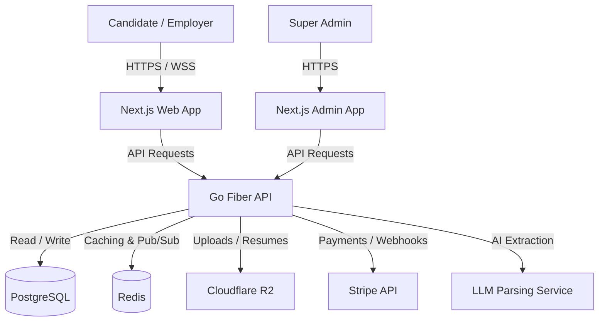

# 🏗️ Jobs View - Project Architecture

Jobs View is organized as a high-performance **monorepo** (managed via npm workspaces or Turborepo). This structure enables code-sharing between the candidate/employer web app, the admin dashboard, and the shared TypeScript types, while keeping the high-speed Go backend decoupled.

---

## 1. Directory Structure

```text
career-platform/
├── apps/
│   ├── web/                    # Next.js - Candidate & Employer facing application
│   │   ├── src/
│   │   │   ├── app/            # App Router (Pages: /, /jobs, /candidate, /employer)
│   │   │   ├── components/     # Web-specific UI components (dashboard widgets, forms)
│   │   │   ├── hooks/          # Custom React hooks (auth, drag-and-drop, fetch)
│   │   │   └── lib/            # Utilities (API client, formatters)
│   │   ├── public/             # Static assets (images, SEO icons)
│   │   └── package.json
│   │
│   ├── admin/                  # Next.js - Super Admin portal
│   │   ├── src/
│   │   │   ├── app/            # App Router (/admin/dashboard, /admin/verification)
│   │   │   └── components/     # Admin-specific data tables, charts
│   │   └── package.json
│   │
│   └── api/                    # Go (Fiber) - High-performance backend API
│       ├── cmd/
│       │   └── api/            # Entrypoint (main.go)
│       ├── internal/
│       │   ├── server/         # Fiber server setup & middleware (JWT, logging)
│       │   ├── handler/        # HTTP handlers (auth, jobs, applications)
│       │   ├── model/          # Go structs representing database entities
│       │   ├── repository/     # Database queries (SQLc or raw SQL)
│       │   └── service/        # Business logic (resume parsing, Stripe, R2)
│       ├── go.mod
│       └── go.sum
│
├── packages/
│   ├── ui/                     # Shared UI library (CSS and React components)
│   │   ├── src/
│   │   │   ├── components/     # Core elements (Button, Input, Card, Badge)
│   │   │   └── styles/         # Global design tokens & CSS (index.css)
│   │   └── package.json
│   │
│   ├── types/                  # Shared TypeScript types
│   │   ├── src/
│   │   │   ├── index.ts        # Exports all type definitions
│   │   │   ├── api.ts          # API Request/Response shapes
│   │   │   └── models.ts       # Database entity reflections
│   │   └── package.json
│   │
│   └── config/                 # Shared configurations
│       ├── eslint/             # ESLint rules
│       ├── typescript/         # tsconfig bases
│       └── package.json
│
├── docs/                       # Platform blueprint & documentation
├── docker-compose.yml          # Local development services (Postgres, Redis)
├── turbo.json                  # Turborepo task pipeline configuration
└── package.json                # Monorepo root package.json
```

---

## 2. Component Boundaries & Code Sharing

### 2.1 The Shared `ui` Package
- Contains all atomic UI elements built using **Vanilla CSS** and React.
- Ensures a consistent visual identity (Design System) across both `apps/web` and `apps/admin`.
- Published locally within the monorepo, so changes to `packages/ui` are instantly reflected in both web applications.

### 2.2 The Shared `types` Package
- Single source of truth for TypeScript interfaces.
- Prevents drift between the Go API response shapes and the Next.js frontend consumption.
- If an API response changes in the Go backend, the `types` package is updated, and TypeScript compiler errors will immediately flag the frontends that need updating.

---

## 3. Data Flow & Integration Architecture



### 3.1 Web Requests & Authentication
1. **Routing:** Next.js handles client-side routing. Protected routes are intercepted by Next.js middleware using JWTs stored in secure, `httpOnly` cookies.
2. **API Communication:** Frontends fetch data from the Go API (`/api/v1/*`). The Go API validates the JWT, handles rate-limiting in Redis, and performs business logic.
3. **Database Layer:** The Go backend interacts with PostgreSQL for relational data and Redis for caching (e.g., job search results, active sessions).
4. **File Storage:** Resumes and logos are uploaded directly to **Cloudflare R2** via presigned URLs generated by the Go API.
