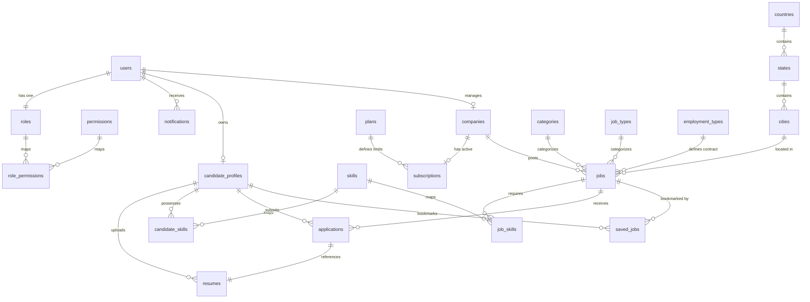

# 📊 Jobs View - Entity Relationship (ER) Diagram

This document maps the complete database structure of Jobs View, illustrating how the 20 core entities connect and behave.

---

## 1. Complete ER Diagram

---

## 2. Cardinality & Relationship Breakdown

### 2.1 User & Profile Associations (One-to-One)
- **`users` ↔ `candidate_profiles` (1:0..1):** A user account of role `JOB_SEEKER` has exactly one candidate profile. Admin or Employer accounts do not have candidate profiles.
- **`users` ↔ `companies` (1:0..1):** A user account of role `EMPLOYER` manages exactly one company.

### 2.2 Core Recruitment Flow (One-to-Many)
- **`companies` ↔ `jobs` (1:N):** A verified company can post multiple job listings. Each job belongs to one company.
- **`jobs` ↔ `applications` (1:N):** A job listing receives multiple applications. Each application belongs to a single job.
- **`candidate_profiles` ↔ `applications` (1:N):** A candidate can submit multiple applications, but only one application per job.
- **`candidate_profiles` ↔ `resumes` (1:N):** A candidate can upload multiple resume versions (e.g., for different roles), but one is flagged as `is_primary`.

### 2.3 Taxonomy & Metadata (Many-to-Many via Joins)
- **`jobs` ↔ `skills` (M:N via `job_skills`):** A job can require multiple skills, and a skill can be required by multiple jobs.
- **`candidate_profiles` ↔ `skills` (M:N via `candidate_skills`):** A candidate can possess multiple skills, and a skill can be possessed by multiple candidates.
- **`roles` ↔ `permissions` (M:N via `role_permissions`):** Roles contain multiple permissions, and permissions can be shared across roles.
