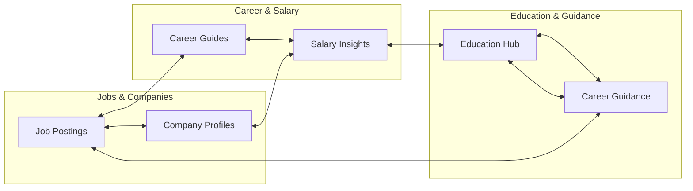

# 🔗 Jobs View - Internal Linking Strategy

This document defines the internal linking architecture of Jobs View, designed to distribute page authority (PageRank) and establish semantic relationships between content pillars.

---

## 1. The Interlinked Content Web

We use a "Silo/Cluster" architecture. Content is grouped into topic clusters, and pages within a cluster link heavily to one another, with clear pathways between related clusters.

---

## 2. Linking Rules by Pillar

### 2.1 Jobs ↔ Companies
- **Job Posting Page:** Must link to the company profile page using the company name as the anchor text (e.g., *"[View Acme Corp Profile]"*).
- **Company Profile Page:** Must list and link to all active job postings for that company.

### 2.2 Career Guides ↔ Salary Insights
- **Career Guide (e.g., "How to become a React Developer"):** Must link to the corresponding salary page using descriptive anchor text (e.g., *"[average React developer salary in India]"*).
- **Salary Page:** Must link back to the primary career guide.

### 2.3 Blogs ↔ Jobs
- **Blog Articles:** When discussing a technology or role (e.g., *"Why Go is dominating backend development"*), the article must dynamically inject a widget linking to the top 3 active Go developer jobs on the platform.

---

## 3. Anchor Text & Crawling Standards

- **Descriptive Anchor Text:** Never use generic anchors like *"click here"*, *"link"*, or *"read more"*. Always use keyword-rich, descriptive text (e.g., *"[explore frontend developer career paths]"*).
- **Breadcrumbs:** Enable breadcrumb navigation on all sub-pages (e.g., `Home > Jobs > React Developer`) with breadcrumb schema. This provides a clear hierarchical crawling path for search bots.
- **Link Limits:** Keep total links on any public page below **150** to prevent diluting the page authority passed to each link.
