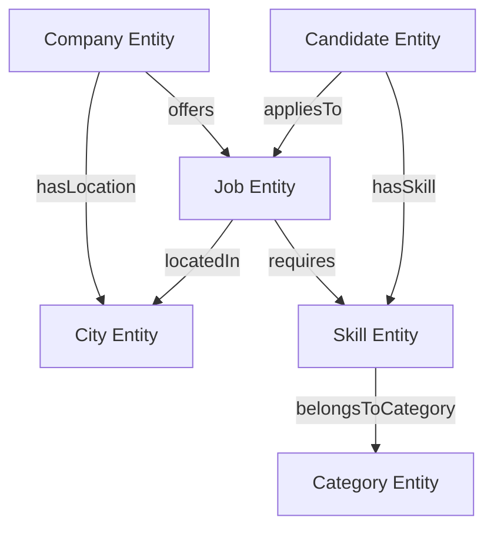

# 🕸️ Jobs View - Knowledge Graph Integration

This document outlines how Jobs View structures and connects data to feed search engine and AI knowledge graphs, establishing the platform as a primary entity source.

---

## 1. Entity & Relationship Mapping

We represent our database as a semantic graph of interconnected entities.



---

## 2. JSON-LD Entity Resolution

To help crawlers resolve these entities, we assign unique, stable identifiers (`@id`) to every core entity in our JSON-LD schemas.

### 2.1 Example: Connecting Job, Company, and Skill Entities
```json
{
  "@context": "https://schema.org",
  "@graph": [
    {
      "@type": "Organization",
      "@id": "https://Jobs View.com/company/acme-corp#organization",
      "name": "Acme Corp",
      "url": "https://acme.com"
    },
    {
      "@type": "JobPosting",
      "@id": "https://Jobs View.com/jobs/react-developer-acme-123#job",
      "title": "React Developer",
      "hiringOrganization": {
        "@id": "https://Jobs View.com/company/acme-corp#organization"
      },
      "skills": "React, TypeScript"
    }
  ]
}
```
By referencing the same `@id` (`#organization`), search engines can immediately link the job posting to the verified company entity in their global knowledge graph.

---

## 3. Wikidata & External Entity Linking
To strengthen our entity authority, we link our categories, locations, and skills to established global databases like **Wikidata** or **Wikipedia**:
- **Skill (e.g., Go):** Link the skill entity to `https://www.wikidata.org/wiki/Q37286` (Go programming language).
- **City (e.g., Bhopal):** Link the city entity to `https://www.wikidata.org/wiki/Q3113` (Bhopal).
- **Implementation:** Added via the `sameAs` field in our JSON-LD schemas.
